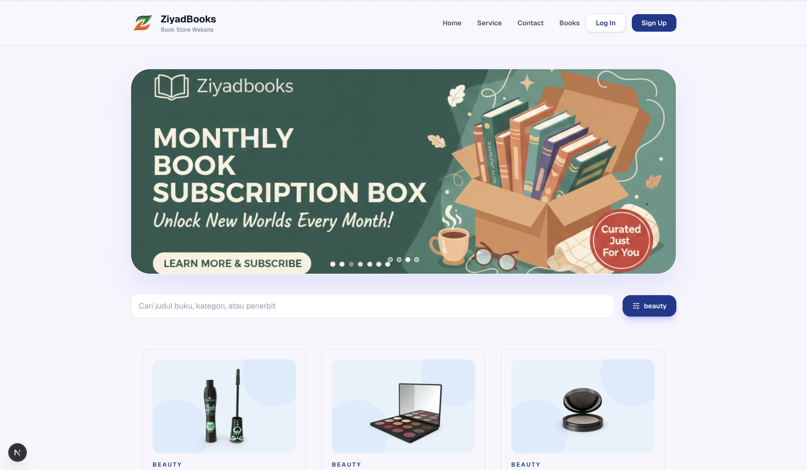

# Katalog Buku Modern

Landing page katalog buku yang responsif dan interaktif dengan Next.js 16. Data diambil dari API DummyJSON (12 produk diasumsikan sebagai buku). UI menonjolkan hero, grid kartu, search real-time, countdown promo kilat, serta state kosong khusus.



## Stack Teknologi
- Next.js App Router (React 19)
- Tailwind CSS 4 untuk styling utilitas
- Axios sebagai klien HTTP
- Ikon Lucide (`SlidersHorizontal`) dan ilustrasi custom untuk pengalaman UX yang rapi

## Fitur Utama
- **Grid responsif**: 1 kolom di mobile dan hingga 3 kolom di desktop (`lg:grid-cols-3`) agar transisi layout tetap mulus saat viewport diubah.
- **Pencarian real-time + filter kategori**: Input dan dropdown kategori mem-filter client-side tanpa reload halaman.
- **Empty state & 404 kustom**: Saat pencarian tidak menemukan hasil atau URL salah, pengguna mendapat ilustrasi `nobooks.png` dengan copy ramah agar tidak terjebak di layar kosong.
- **Promo kilat**: Section countdown memakai hook `useCountdown` yang sinkron dengan data buku flash sale.
- **Modular layout**: `Header`, `Hero`, `LandingContent`, dan `Footer` dipisah supaya mudah dikembangkan.

## Contoh Fetch API (Axios)
`src/lib/api.tsx` menormalisasi data dari DummyJSON sebelum dipakai komponen.

```ts
import axios from 'axios';
import { Books } from '@/types/books';

export async function fetchBooks(): Promise<Books[]> {
  const res = await axios.get('https://dummyjson.com/products?limit=12');
  const data: { products: Books[] } = res.data;

  return data.products.map((item) => ({
    id: item.id,
    title: item.title,
    category: item.category,
    brand: item.brand,
    thumbnail: item.thumbnail,
    price: item.price,
    description: item.description,
    rating: item.rating,
    stock: item.stock,
  }));
}
```

## Logika Pencarian Real-time
`useFilteredBooks` melakukan filtering berdasarkan query dan kategori secara memoized supaya performa stabil.

```ts
import { useMemo } from 'react';
import type { Books } from '@/types/books';

export function useFilteredBooks(
  books: Books[],
  query: string,
  selectedCategory: string
) {
  return useMemo(() => {
    let result = books;
    if (selectedCategory) {
      result = result.filter((book) => book.category === selectedCategory);
    }

    if (!query) return result;
    const normalizedQuery = query.toLowerCase();

    return result.filter((book) =>
      [book.title, book.category, book.brand].some((field) =>
        field.toLowerCase().includes(normalizedQuery)
      )
    );
  }, [books, query, selectedCategory]);
}
```

Komponen `SearchBar` menampilkan input dan tombol filter dengan ikon `SlidersHorizontal`. Ketika daftar hasil kosong, `BookGrid` otomatis mengganti tampilan ke empty state ilustratif.

## Cara Menjalankan
1. Install dependency: `npm install`
2. Jalankan dev server: `npm run dev`
3. Buka `http://localhost:3000`, resize browser untuk melihat transisi grid mobile ↔ desktop, lalu coba query yang relevan dan yang tidak ada untuk memunculkan empty state.

## Struktur Proyek
- `src/components` – UI modular (header, hero, kartu, search, empty state, flash sale, dll.)
- `src/hooks` – Hooks `useBooks`, `useCountdown`, dan `useFilteredBooks`
- `src/lib/api.tsx` – Klien API berbasis Axios
- `public/` – Asset marketing termasuk `showcase.png`

## Catatan Deployment
- Duplikasi `.env.example` ke `.env.local`, isi `NEXT_PUBLIC_SITE_URL` dengan domain akhir (mis. URL Vercel). Nilai ini dipakai oleh `robots.txt` dan `sitemap.xml`.
- `src/app/sitemap.ts` menyediakan endpoint sitemap, sedangkan `src/app/robots.ts` menunjuk ke sitemap tersebut.
- Deploy ke Vercel tidak butuh konfigurasi ekstra: cukup hubungkan repo dan set environment variable di dashboard.

Silakan fork, rekam video showcase (resize + search + empty state), lalu kirim link repo & video sesuai brief.
